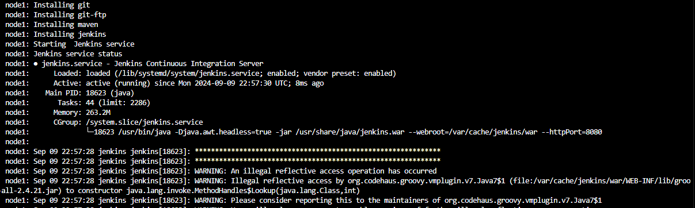

# MODULE 3 JENKINS

## Context

Jenkins is an open source automation server which enables developers around the world to reliably build, test, and deploy their software.

It helps automate the build, test and deployment parts of software development, and facilitates continuous integration and continuous delivery. Written in Java, Jenkins runs in a servlet container such as Apache Tomcat, or in standalone mode with its own embedded web server. 

## Outlines

Part      | Description
----------|-------
Part 1    | Prepare the environment
Part 2    | Configuring Jenkins and initial job
Part 3    | Jenkins integration with Git
Part 4    | Deployment with Tomcat
Part 5    | Complete CI/CD with Jenkins Declarative Pipeline

## Virtual Machines

Server        | IP Address      |  Vagrant box
--------------|-----------------|---------------
Jenkins       | 172.17.8.163    | bento/ubuntu-20.04
Tomcat        | 172.17.8.164    | bento/ubuntu-20.04

## Setting

- Jenkins node

Tools (Jenkins)           | Versions
--------------------------|-------
Jenkins                   | 2.462.2
Git                       | 2.25.1
Openjdk                   | 17

- Tomcat node

Tools (Tomcat)            | Versions
--------------------------|-------
Tomcat                    | 9.0.93
Openjre                   | 17

## Ongoing Tests

Tested on September 09, 2024 : 
- Steps during vagrant initialization for Jenkins-Ubuntu-VM.
$ vagrant up

- Steps during vagrant initialization for Tomcat-Ubuntu-VM.
$ vagrant up

## Issues and troubleshooting

- Tomcat Version : 404 Not Found (Update Tomcat version with the appropriate value in tomcat.sh : TOMCAT_VERSION="9.0.80" -> TOMCAT_VERSION=[NEW_VERSION])
- If you have an connection timeout when booting the VM and an error on type "kernel panic not syncing attempted to kill the idle task" on the console, it will be necessary to upgrade the number of CPU on Vagrantfile (Example : From 1 to 2)