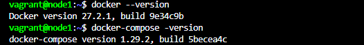

# MODULE 4 DOCKER

## Context

Docker is a platform that enables running applications in software containers. 

With Docker, you can package an application in one or more containers that can run on any server, whether it's a physical machine or a virtual one. Docker is compatible with both Linux and Windows Server. It simplifies application deployment and infrastructure management.

## Outlines

| Part   | Description                      |
| ------ | -------------------------------- |
| Part 1 | Prepare the environment          |
| Part 2 | Application deployment without Dockerfile |
| Part 3 | Application deployment with Dockerfile    |
| Part 4 | Docker Compose                   |
| Part 5 | Docker Swarm                     |
| Part 6 | Docker Stack                     |

## Virtual Machines

| Server | IP Address   | Vagrant box        |
| ------ | ------------ | ------------------ |
| Node1  | 172.17.8.104 | bento/ubuntu-20.04 |
| Node2  | 172.17.8.105 | bento/ubuntu-20.04 |

## Setting

### Node1

| Tools         | Versions |
| ------------- | -------- |
| Docker        | 27.2.1   |
| Docker Compose| 1.29.2   |

### Node2

| Tools  | Versions |
| ------ | -------- |
| Docker | 27.2.1   |

## Ongoing Tests

Tested on **September 10, 2024**:

Steps during vagrant initialization for Docker-Ubuntu-VM.
```
$ vagrant up
$ vagrant ssh node1
```


```
$ docker --version
$ docker-compose -version
```



## Issues and troubleshooting

- If you have a connection timeout when booting the VM and an error on type "kernel panic not syncing attempted to kill the idle task" on the console, it will be necessary to upgrade the number of CPUs on Vagrantfile (Example: From 1 to 2)

