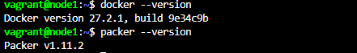

# MODULE 5 PACKER
## Context

Packer is a free and open source tool for creating golden images for multiple platforms from a single source configuration. 

Packer is an open source tool for creating identical machine images for multiple platforms from a single source configuration. Packer is lightweight, runs on every major operating system, and is highly performant, creating machine images for multiple platforms in parallel. Packer does not replace configuration management like Chef or Puppet. In fact, when building images, Packer is able to use tools like Chef or Puppet to install software onto the image.

A machine image is a single static unit that contains a pre-configured operating system and installed software which is used to quickly create new running machines. Machine image formats change for each platform. Some examples include AMIs for EC2, VMDK/VMX files for VMware, OVF exports for VirtualBox, etc.

## Outlines

Part      | Description
----------|-------
Part 1    | Prepare the environment
Part 2    | Build docker image
Part 3    | Build other image for VirtualBox provider

## Virtual Machines

Server        | IP Address      |  Vagrant box
--------------|-----------------|---------------
Node1         | 172.122.1.25    | bento/ubuntu-20.04

## Setting

- Node1

Tools (Node1)             | Versions
--------------------------|-------
Docker                    | 27.2.1
Packer                    | 1.11.2

## Ongoing Tests

Tested on **September 10, 2024**:

Steps during vagrant initialization for Packer-Ubuntu-VM.
```
$ vagrant up
$ vagrant ssh node1
```


```
$ docker --version
$ packer --version
```



## Issues and troubleshooting

- If you experience a connection timeout when booting the VM and an error message "kernel panic not syncing attempted to kill the idle task" on the console, you may need to upgrade the number of CPUs in the Vagrantfile (e.g., from 1 to 2).
