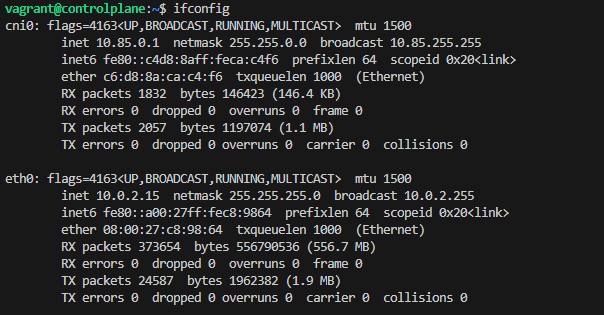
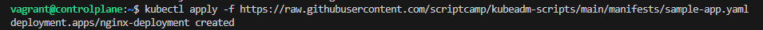
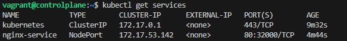
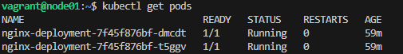
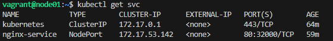

# MODULE 6 KUBERNETES

## Context

Kubernetes, also known as K8s, is an open-source system for automating deployment, scaling, and management of containerized applications. 

It groups containers that make up an application into logical units for easy management and discovery.


## Outlines

Part      | Description
----------|-------
Part 1    | Install Kubernetes
Part 2    | Install Kubernetes with Vagrant provisioner
Part 3    | Deploy Voting App on Kubernetes Cluster
Part 4    | Managing Kubernetes Cluster


## Virtual Machines

K8S-Ubuntu-VM

Server        | IP Address      |  Vagrant box
--------------|-----------------|---------------
Node1(K8s)    | 10.10.1.120     | bento/ubuntu-20.04
Node2(K8s)    | 10.10.1.122     | bento/ubuntu-20.04

Kubernetes-Ubuntu-VM

Server               | IP Address   |  Vagrant box
---------------------|--------------|---------------
Node1(Kubernetes)    | 10.0.0.10    | bento/ubuntu-18.04
Node2(Kubernetes)    | 10.0.0.11    | bento/ubuntu-18.04

## Setting

- K8S-Ubuntu-VM

Tools (Node1 & Node2)     | Versions
--------------------------|-------
Docker                    | 20.10.8
Kubernetes                | 1.20.6-00


- Kubernetes-Ubuntu-VM

Tools (Node1&Node2)       | Versions
--------------------------|-------
Docker                    | 20.10.8
Kubernetes                | 1.20.6-00


## Ongoing Tests

Tested on **September 22, 2024**:

Steps during vagrant initialization for Kubernetes-Ubuntu-VM.
```
$ vagrant up
```

Connection and check to the controlplane
```
$ vagrant ssh controlplane
$ ifconfig
```


Deploying a Nginx service into the Cluster
```
$ kubectl apply -f https://raw.githubusercontent.com/scriptcamp/kubeadm-scripts/main/manifests/sample-app.yaml
$ kubectl get services
```



Connection and check to the Target Node (Worker Node)
```
$ vagrant ssh node01
```


Getting all Pods and Services running into the Target Node (Worker Node)
```
$ kubectl get pods
$ kubectl get svc

```




## Issues and troubleshooting

- If you have an connection timeout when booting the VM and an error on type "kernel panic not syncing attempted to kill the idle task" on the console, it will be necessary to upgrade the number of CPU on Vagrantfile (Example : From 1 to 2)
